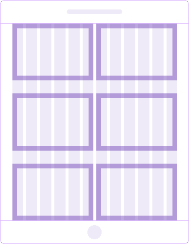
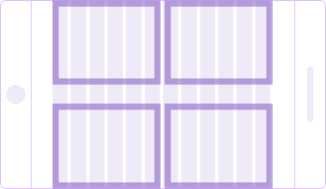

## Description

- The layout of the page depends on the breakpoint.
- Each range determines the number of columns, maximum content width and content wrapper margins.
- You can set your own breakpoints, if it's necessary for the correct display of the interface in a particular case.

## Page layout and grid behavior

> On 1200px left menu with width of 250px appears and "eats away" space of the product page.

| Breakpoint                      | Columns | Gutter | Max. content width                                    | Content wrapper margins                                                                | Layout scheme                                     | Description                                                                                                               |
| ------------------------------- | ------- | ------ | ----------------------------------------------------- | -------------------------------------------------------------------------------------- | ------------------------------------------------- | ------------------------------------------------------------------------------------------------------------------------- |
| **min-width: 320px** (320-767)  | 4       | 24px   | 500px for landing pages                               | `margin: 16px 0px 80px` for landing and product pages                                  |             | **Mobile & tablet devices**. The content has a one-column structure. The left menu is hidden.                             |
| **min-width: 768px** (768-1199) | 6       | 24px   | 720px                                                 | `margin: 24px 24px 96px` for landing pages, `margin: 16px 24px 96px` for product pages |             | **Mobile & tablet devices**. You can arrange the content as a two-column structure. The left menu is hidden.              |
|                                 |         |        |                                                       |                                                                                        |   | **Mobile & tablet devices (landscape mode)**. The content is arranged as a two-column structure. The left menu is hidden. |
|                                 |         |        |                                                       |                                                                                        |           | **Desktop devices**. The content is arranged as a three-column structure. The left menu is hidden.                        |
| **min-width: 1200px** (1200-∞)  | 12      | 24px   | 980px for landing pages, **1920px for product pages** | `margin: 24px 24px 96px` for landing pages, `margin: 16px 32px 96px` for product pages |           | **Tablet & desktop devices**. The left menu is open. Rearrange the content as a three-column structure.                   |
|                                 |         |        |                                                       |                                                                                        |  | **Tablet (landscape mode)**. The left menu is open. Rearrange the content as a two-column structure.                      |

## Content max-width

Sizes in our grid system are based on the sizes of the left menu width (250px) and the maximum content width of our product pages.

**The recommended maximum width of the content:**

- for the product landing pages is 980px;
- for the product pages is 1920px.

@page grid-api
@page grid-code
@page grid-changelog
