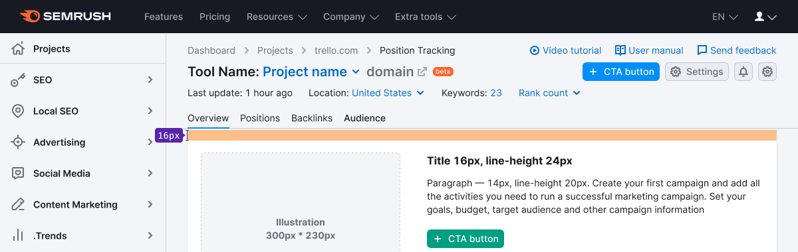
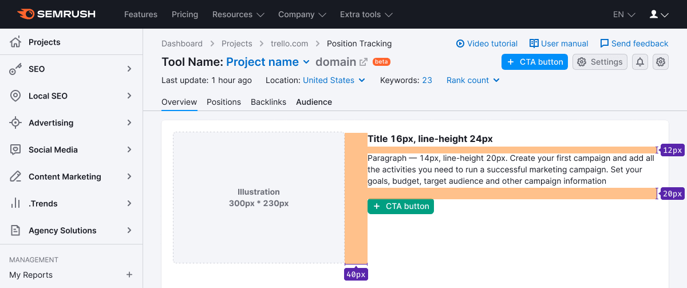
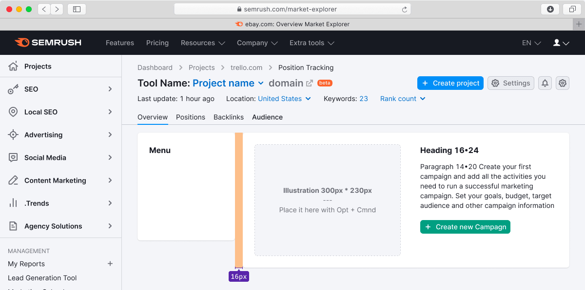
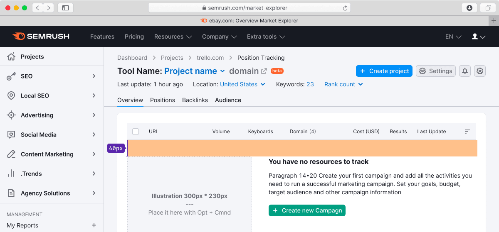
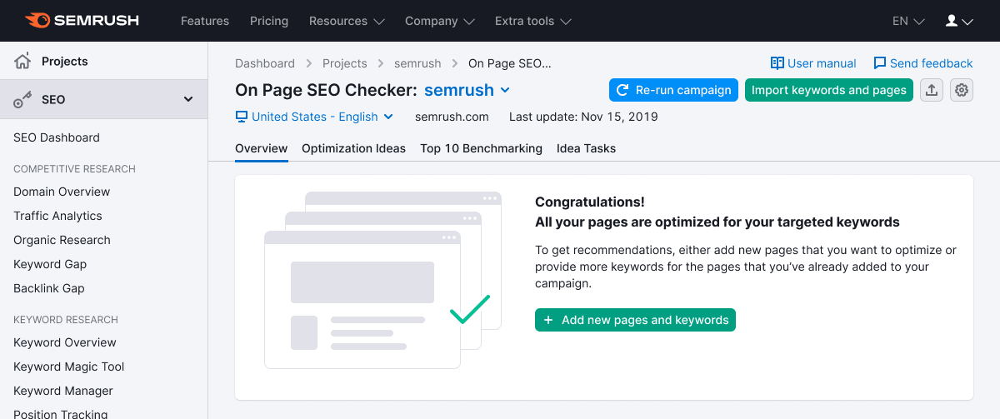

## Description

**Empty page** is the pattern for "blank" state of the product. May be helpful as an advertising state to enable other product/service.

Commonly, the user faces this state, when certain actions are required to start working and gather data in the product.

**For example, this state indicates that:**

- we can't display the data because the user doesn't have the right product / service / account enabled;
- there is no data to display because the user hasn't created or configured anything in the product yet;
- "Soon there will be an awesome report here" (you need to display something as an advertising for the future feature).

## Default styles

1. Illustration is always located to the left of the message and size – 300px \* 230px.
2. For title use text with 20px size (`--fs-400`, `--lh-400`).
3. For the description use 14px size (`--fs-200`, `-lh-200` tokens). Use this font-size carefully, and always check it's readability and contrast against background.
4. For CTA use button with `use:"primary"` and M size.
5. The entire message "sticks" to the left side of the page and doesn't stretch over the full width of the page.
6. **Don't make content width more than 660px (otherwise it becomes difficult to read).**

> As an option, add tertiary button, which can open a dropdown with additional information.

### Margins and sizes

## "Empty" state and sidebar

## "Empty" state in the table

See more information in the [Table states](/table-group/table-states/#empty_table/).

## Examples of images for empty states

You can make your illustrations for each specific situation. Illustration should carry out an advertising function and reflect the essence of the product which is currently hidden from the user.

