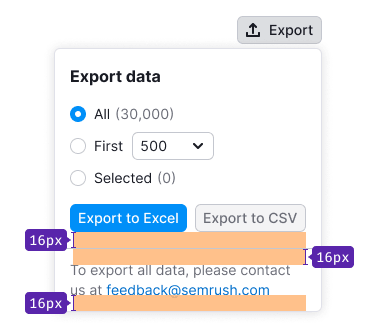

## Description

**Export pattern** describes the process and the components used in exporting data to various formats.

To add the data export, provide a button that users can click to initiate immediate data export and/or download in a specific format.

## Trigger

### Default

- Use this version when there's enough space available to configure export settings.
- If exporting is the main action on the page, employ a button with `use: "primary"`.
- The export button opens a dropdown menu containing the export form.

### Compact

- Utilize the compact version when space is limited. Include a tooltip with a descriptive label to inform users about the button's purpose.
- The export button opens a dropdown menu with the export form.

::: tip
Remember to add an aria-label for the button with no text.
:::

### Expanded version

- Choose this version when exporting to a single format, and no additional settings are required.
- The export button opens a dropdown menu with the export form.

::: tip
If there's no data available for download, the file is still downloaded with the table headers. The file should not be empty, as it's important to show users that the export is functioning.

For time-consuming processes, the button gets a loading state. The recommended spinner display time is `300ms`.
:::

## Dropdown

- Clicking the export trigger opens the dropdown. The trigger gets an `active` state.
- The dropdown content may comprise various components, depending on the product. It should include at least two download buttons.
- The dropdown's width and height adjust based on the content.

## Compact dropdown

When exporting is feasible in at least two formats with no additional settings, the button opens a list of available data formats.

- Clicking an item closes the dropdown and initiates browser-based file download.
- During time-consuming processes, the button gets a loading state.

## Export with settings

- Include the title "Export Data" in this dropdown version.
- For exporting to one or two formats, use full format names on buttons (for example, "Export to CSV").
- For three formats, use shortened format names (for example, "CSV" instead of "Export to CSV").
- If there's no data available for all export parameters and settings, avoid disabling the buttons.

::: tip
Additional controls can also be added to the dropdown.
:::

### Postponed export

- Use this pattern when exporting a large file immediately isn't feasible.
- Pre-fill the email input with the user's profile email.
- Buttons should display possible data export formats.

## Group of settings

- The radio group defaults to the "All" value if nothing is selected in the table.
- If a value is selected in the table, the corresponding "Selected" value is activated upon opening the dropdown.
- The opening of the dropdown automatically activates the associated radio button.

## Additional information

### Additional information on downloading all data and export in general

- Place this information below the buttons.
- Use it to explain conditions for downloading all data, addressing limitations, large export sizes, etc.
- Use the [Divider](/components/divider/divider) to separate this information from the form above.

Use this message for such cases: "To export all data, please contact us at {email}". Alternatively, link to a page with a custom report form, displaying the message: "To export all data, please order a custom report."

### Additional information concerning the selected export settings

- Place this information below the buttons.
- If additional information in the dropdown pertains to data export due to selected settings, use the [Divider](/components/divider/divider) to separate it from the form above.

## Edge cases

### Error

For error messages, employ the following text: "Please try again later. If the problem persists, contact us at {email}".

- In case of export operation failure, display a [warning notice](/components/notice/notice) at the dropdown's bottom.
- If the problem is known, describe it in the notice title immediately.
- If the problem can't be identified, use a standard text along with the team's email.

For the compact dropdown version, use a [NoticeBubble](/components/notice-bubble/notice-bubble) for such errors.

### Limit

For limit messages, display a [Notice](/components/notice/notice) at the dropdown's bottom.

Users can access all settings, allowing them to explore export options that may necessitate an upgrade. However, the export buttons remain disabled.

### Loading

- Loading may occur upon the initial dropdown opening and after clicking the export button.
- During loading, wrap the entire form within a [SpinContainer](/components/spin-container/spin-container).
- Employ the [Spin](/components/spin/spin) component with an XL size for all dropdowns.
- The dropdown closes following the loading state, initiating file download in the browser.

