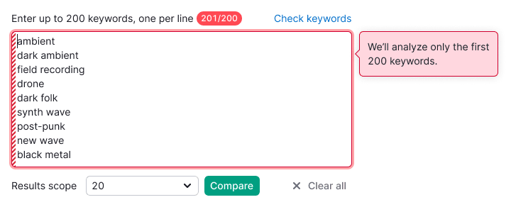
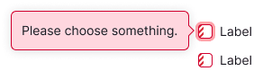
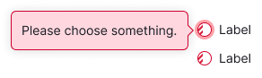
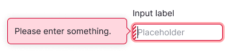
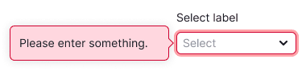
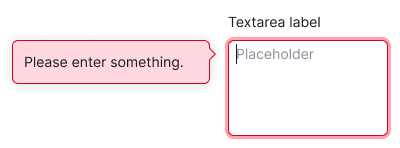

## Description

**Validation** refers to the system's process of confirming values entered by the user.

## How validation works

- In forms and filters, validation can be executed concurrently through `unFocus` and `Submit`. Note: This option is not suitable for forms with limits; use only `Submit` for them.
- Empty fields (where the user has not entered any value) should not be validated by `unFocus`.

::: tip
Since form validation can be triggered by button clicks, it is advisable not to disable primary buttons. This prevents users from mistakenly thinking that the form or filter is entirely dysfunctional.
:::

- Following validation by `unFocus`, erroneous inputs are highlighted. Upon focusing on them, a tooltip emerges, guiding users on necessary adjustments within the form.
- Post validation via `Submit`, inputs with errors acquire an `invalid` state. Focus, accompanied by a tooltip, is directed towards the first erroneous input.
- If the page is long, focusing on the initial input with an error should scroll the page to it. In such cases, a tooltip providing correction guidance should also be visible.

::: tip
The tooltip elucidates why an input receives an invalid state or offers instructions for sending data. Whenever possible, ensure the tooltip is positioned near the input or control and conclude the text with a period.
:::

### How the invalid state is removed from the input

- If browser-based validation is in play, the `invalid` state can be reset as soon as the input becomes `valid`.
- For server-based validation, the `invalid` state can be reset each time input data changes.

If users address inputs with errors out of sequence, all uncorrected inputs will remain highlighted, unless changes are made to them.

## unFocus validation

Where deductions of paid limits and backend complexities are absent, immediate validation can be applied as users complete forms. Utilize this validation approach to facilitate form and filter completion. Displaying correction cues before submitting the form is recommended.

## Appearance

Uniformly, all form elements assume an `invalid` state, marked by a `var(--border-danger-active)` border. When focused, this state triggers a tooltip in the `warning` theme.

## Notice with error message

For guidance on positioning the error message notice, consult the [Notice guide](/components/notice/notice).

## Validation messages

A standard text pattern is: Please enter something.

Table: Validation messages

| Condition  | Text            |
| ---------- | --------------- |
| Empty field | If referring to user data input, use: Please enter your [field name]. |
| Entering someone else's data | Use: Please enter a/an [field name].  |
| Field filled with erroneous data | For instance, with email field: Please enter a valid email. |
| Checkbox error for Terms & Conditions | Use: Please confirm that you agree to our Terms and Conditions and Privacy Policy.   |

