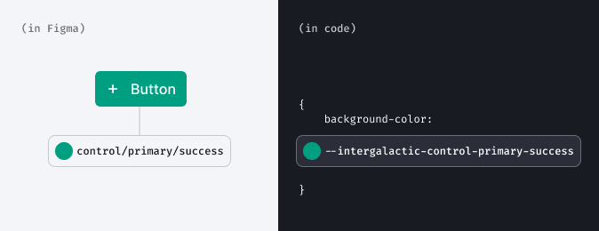
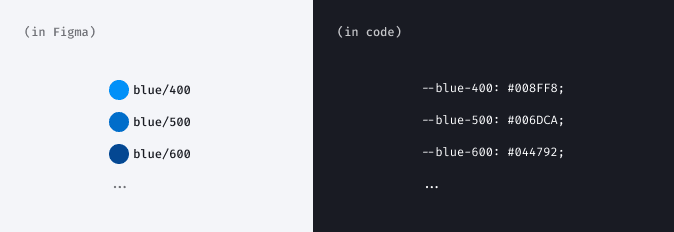
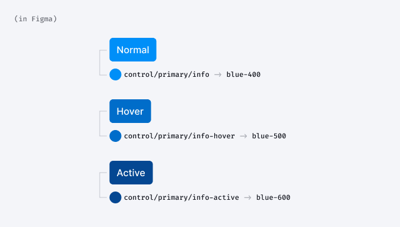
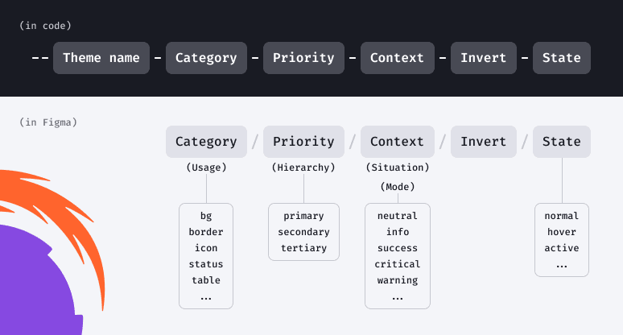
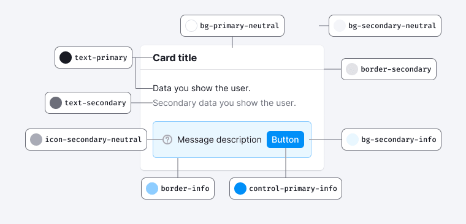
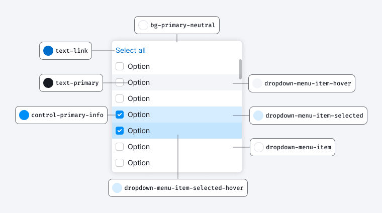
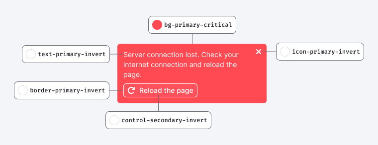
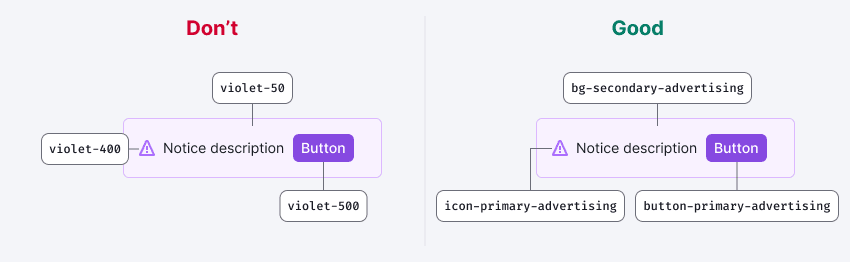

## What is a design token?

Basically, design tokens are atoms of the design system's visual styles. Think of them as values stored as predefined styles for predefined purposes, elements, and components.

## Token sets

There are base and semantic token sets in our design system.

**Base tokens** represent the theme's global palette. Changing their values will affect semantic tokens. Therefore, by changing the palette, you can create new themes. For creating new palette you can use tools like [Huetone](https://huetone.ardov.me/).

**Semantic (alias) tokens** relate to a specific component or context of usage. They refer to the base tokens.

Semantic tokens include tokens for:

- colors;
- typography;
- sizing;
- spacings;
- box-shadows;
- border-radius.

## Token naming structure

Token name is the same in both Figma and code, except for the theme/project name which is added to the token in the code.

For example, compare token for primary neutral background:

- in Figma: `bg/primary/neutral`;
- in code: `--intergalactic-bg-primary-neutral`.

::: tip
The token name doesn't have to contain all the elements of the naming structure. The naming structure creates a system so you can easily name the new token, and it will fit into the design system.
:::

## Tokens usage

Semantic tokens are context-specific, so they are used according to the intentions implied by their names:

- `bg` token group for backgrounds;
- `control` token group for all button-like controls;
- `text` token group for typography;
- `date-picker` token group for DatePicker;
- etc.

Base tokens can be used for new elements and components which are not in the Intergalactic Design System yet, but only if semantic tokens are not suitable.

## How to make a new theme

Please see the detailed process explained in the Figma file: [internal](https://www.figma.com/file/K1s6wF8NTH3uNHvjkn6hjc/Themes-playground-%26-tutorial-%F0%9F%8E%93?node-id=24%3A90461&t=uZCoQy8xPBjC1ctm-11), public (link will be here soon).
