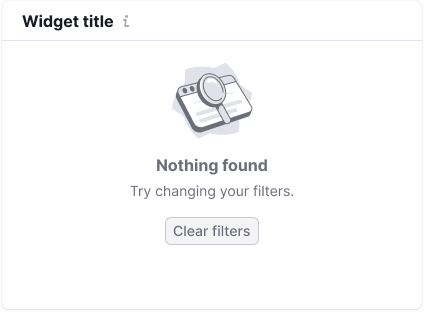

## Description

**Illustration** is a component for importing illustrations from our library to your project.

## Illustrations

@import illustrations

## Sizes

We use illustrations of three sizes.

| Size (px)  | Illustration example         | Usage                           |
| ---------- | ---------------------------- | ------------------------------- |
| Large (130px * 130px) |     | Use this size for advertising messages.    |
| Medium (80px * 80px)  |   | Use this size for error messages and empty states.     |
| Small (40px * 40px)   |     | Use this size for secondary messages that shouldn't draw much attention. |

@page illustration-a11y
@page illustration-api
@page illustration-code
@page illustration-changelog
