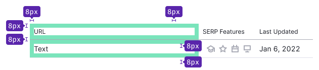
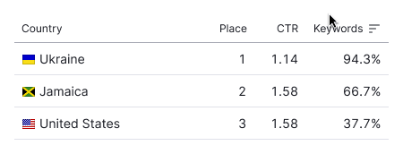
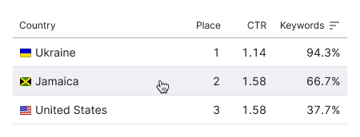

## Description

**Secondary table** is a table type designed for compactly displaying a small amount of data within widgets and [cards](/components/card/). These tables usually have limited functionality, often simple features like sorting.

## Appearance

### Paddings

In a secondary table, whether it's a header or a row, cells use `--spacing-2x` token for padding.

### Styles

::: tip
If there's a sorting icon in the column, the icon should be in the active state with a `--icon-secondary-neutral-hover-active` color.
:::

Table: Secondary table styles

| Description | Appearance                                  | Styles                                                                      |
| ----------- | ------------------------------------------- | --------------------------------------------------------------------------- |
| Heading     |  | `background-color: var(--table-td-cell); border-bottom: 1px solid var(--border-table-accent)` |
| Default row |  | `background-color: var(--table-td-cell); border-bottom: 1px solid var(--border-secondary)` |

## Row states

For more information, refer to the general [DataTable](/table-group/data-table#table-row-states) guide.

