> For general recommendations on modal window content styles, refer to [Content in modal window](/patterns/modal-content/).

@## Description

**Modal window** is a modal dialog that appears on top of the page, and shows an important information or request a response from the user.

It always disables user interaction with the main window but keeps it visible. The modal window remains on the screen until the user performs the required action or closes the window.

> _🐈 A modal dialog is like my cat, Emma – who meows at 7am every morning to prompt me to feed <!-- vale DevDocs.Gender = NO -->her<!-- vale DevDocs.Gender = NO -->. I might be trying to sleep or get ready for the day, but my cat will place herself in front of me, then meow louder and incessantly until I look at <!-- vale DevDocs.Gender = NO -->her<!-- vale DevDocs.Gender = NO -->. I have to stop what I am doing to address the cat immediately if I ever hope to finish my task._
>
> Article at [NNGroup](https://www.nngroup.com/articles/modal-nonmodal-dialog/)

**Use modal window:**

- To show secondary data. _For example, settings, small forms to fill out, step-by-step actions, detailed information about any data._
- To draw attention to a specific request or task. _For example, confirming an operation, adding data._
- To focus on critical information that requires the user's attention. _For example, local news, limiting, deleting an element, or losing information._
- To view enlarged image or video.

**Don't use modal window:**

- To notify of an error in the interface or system.
- To show content that is required for the user to complete the main task in the interface.

> If you want to hide a lot of information in the modal window, this component may not be the best solution. Consider using [FullscreenModal](/components/fullscreen-modal/) or even a separate page.

Don't show modals before the user has interacted with the interface. **Modal windows with information about limits are the exception in this case.**

@## Component composition

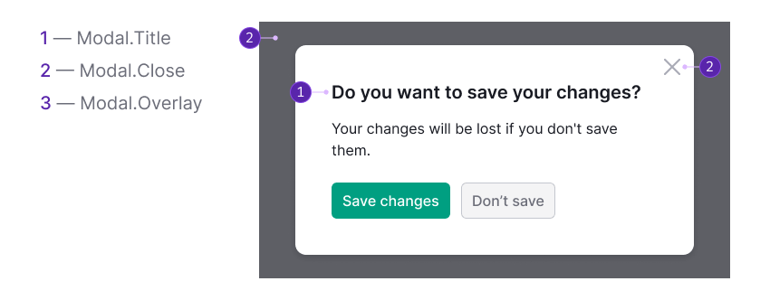

The Modal window consists of the following:

- `Modal.Window`.
- `Modal.Title`.
- Content.
- `Modal.Close`.
- `Modal.Overlay`.

@## Modal window types

We have several modal window types in the design system:

- default (it can be one- and two-zoned);
- [Carousel](/components/carousel/);
- [FullscreenModal](/components/fullscreen-modal/), can also be one- or two-zoned.

@## Modal window styles

### Modal.Window (Container)

@table-caption Container styles for Modal window

| Styles                                                                 | Appearance example                                 |
| ---------------------------------------------------------------------- | --------------------------------------- |
| `border-radius: var(--rounded-large)`, `padding: var(--spacing-10x)` | 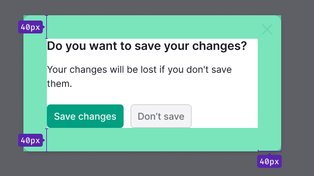 |

### Modal.Close (Close button)

@table-caption Close button styles for Modal window

| Styles                                                                                                                                                 | Appearance example                                                       |
| ------------------------------------------------------------------------------------------------------------------------------------------------------ | ------------------------------------------------------------- |
| `Close` icon uses M size, `--icon-secondary-neutral` token for the default color, and changes its color using CSS filter to the darker one in hover state. | 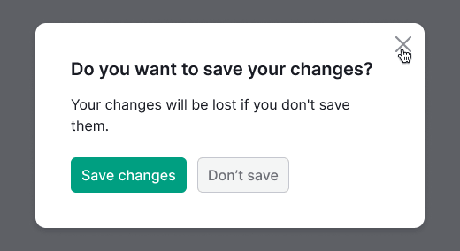           |
| Paddings from top and right to the `Close` icon is 12px.                                                                                               | 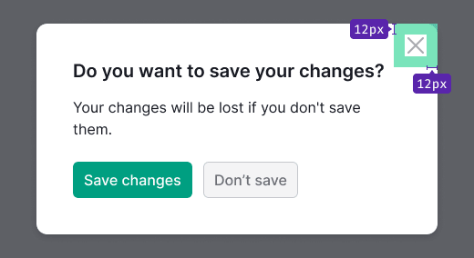                |
| The target area is 48px * 48px.                                                                                                              | 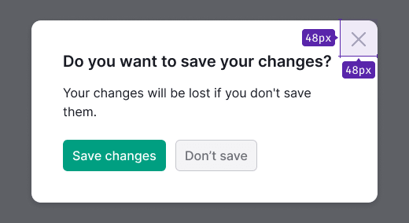 |

### Modal.Overlay

@table-caption Overlay styles for Modal window

| Tokens                                                                                        | Appearance example                                     |
| --------------------------------------------------------------------------------------------- | ------------------------------------------- |
| `--overlay-primary`                                                                           | 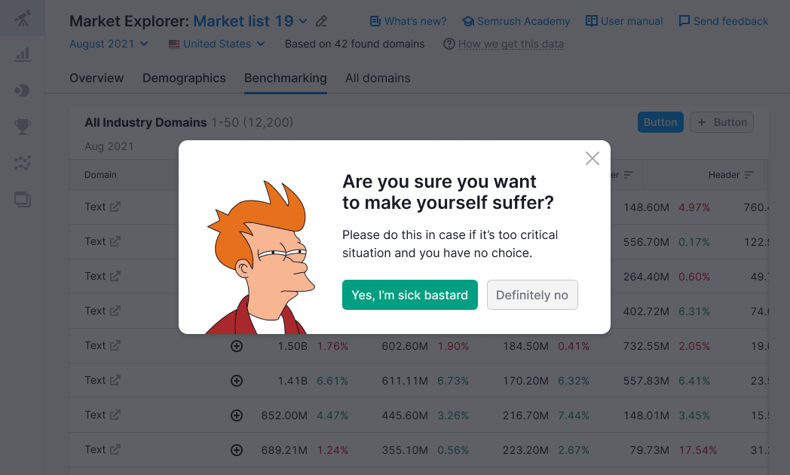  |
| Second overlay appears when opening a modal window inside another modal window, and uses `--overlay-secondary` token. | 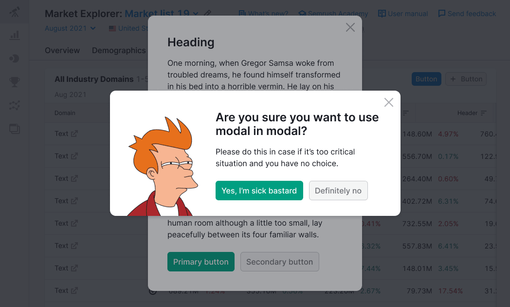 |

> Use a modal window inside another modal window only if no other solution fits your case. Refer to an [amazing Manifesto](https://modalzmodalzmodalz.com/) against the ubiquitous use of modal windows.

@## Modal window size

The modal window must have `min-width` of 320px for the desktop version.

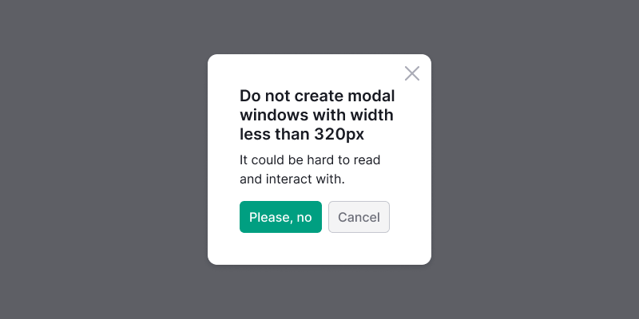
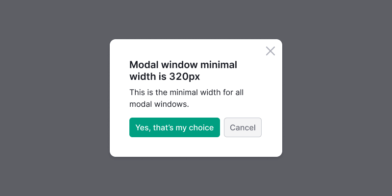

@## Interaction

### Opening a window

When user opens the window, keyboard focus should automatically go to the content of the modal window. If the modal window contains a form, the focus must go to the first input or interactive element.

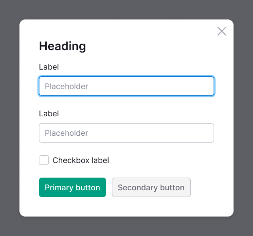

### Opening window inside window

When opening a modal window within another modal window, it is important not to close the previous modal window. Doing so can confuse users and create a sense that they are unable to navigate back to the previous window.

### Closing window

User closes the modal window by using the following options:

- `Close` icon;
- CTA or "Cancel" button;
- `ESC` key;
- "Back" button in the browser (nothing changes on the parent page in this case);
- clicking outside the `Modal.Window` area.

When the modal window is closed by keyboard, the focus should return to its trigger.

If the potential consequences of accidentally closing the window are significant, please alert the user about the potential loss of information.

It is recommended to save the information entered by the user when closing and reopening the modal window. If it isn’t possible to do so, inform users that their entered data will be lost upon closing the window.

### Loading

When loading or reloading content within the modal window, display the [Spin](/components/spin/) component over the content.

Spin styles for this scenario:

- Use the largest size for the spinner inside the modal window — `XXL`.
- Center the spinner in relation to the content.
- Optionally, add text to the spinner.

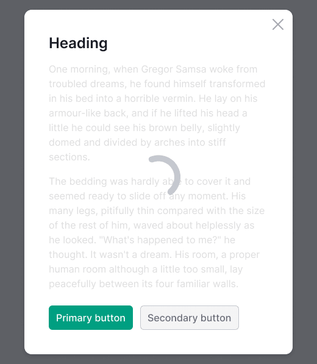

@## Positioning

The modal window is centered vertically and horizontally by default relative to the browser window.

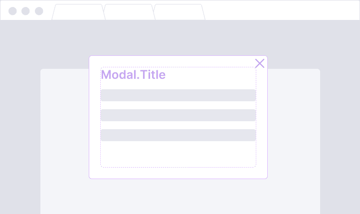

If the content of the modal window requires a large size, modal window is positioned with 40px margins on all sides.

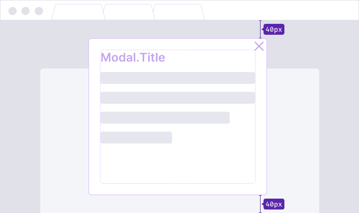
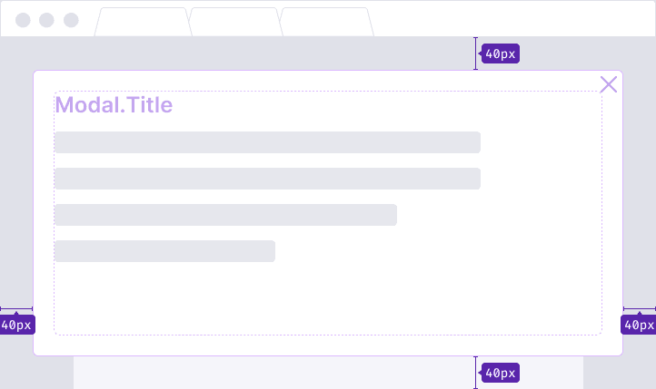

If the size of the modal window changes when the user interacts with it, it is recommended to anchor it to the top border with a 40px margin.

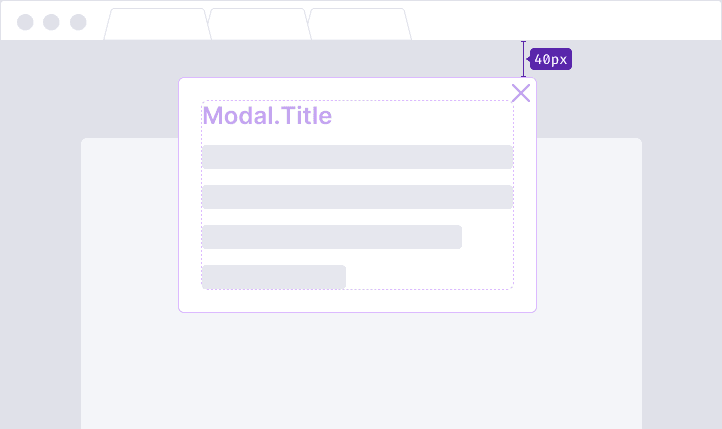
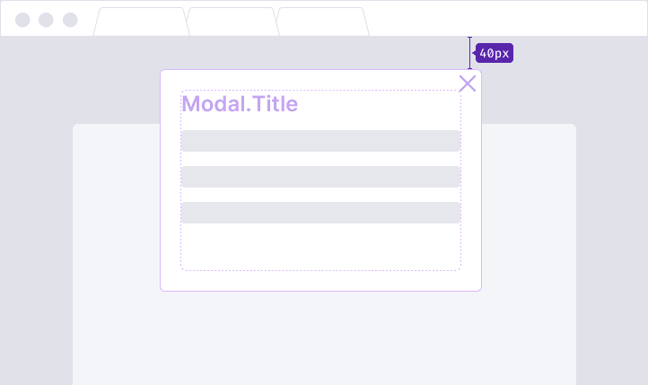

@## Changing browser size

### Vertically

- When the height of the screen increases, the modal window remains unscaled and stays centered.
- When reducing the screen height, the window continues to be centered as long as it fits within the visible area. Once it reaches the minimum distance from the upper and lower edges of the browser, the window extends beyond the lower border, and scrolling becomes necessary.

### Horizontally

Currently, when the browser width is reduced to 320px, the modal window is proportionally scaled down while maintaining the margins to the 12px. Simultaneously, the window occupies a larger portion of the viewport, shrinking proportionally to match the size of the device screen.

Refer to [examples](/components/modal/modal-code/) of the modal window to see how modal changes to fit the screen.

> _It is recommended to avoid using modal windows on mobile devices. However, if you use modal windows on mobile devices, leave a link to the parent page. If scrolling in modal window appears due to the amount of content, then it is recommend placing the window close button both at the top and at the end of such window, or fixing it in the header when scrolling._
>
> [10 guidelines to consider when using overlays/modals](http://www.uxforthemasses.com/overlays/)

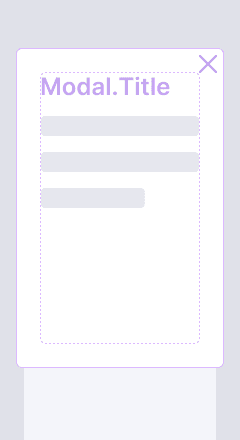

@## Scrolling the window

If the height of the modal window exceeds the height of the browser window, it should be positioned with a 40px margin from the top border.

**The content underneath the overlay shouldn't be scrollable.**

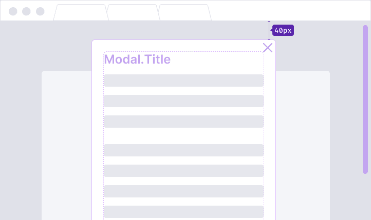
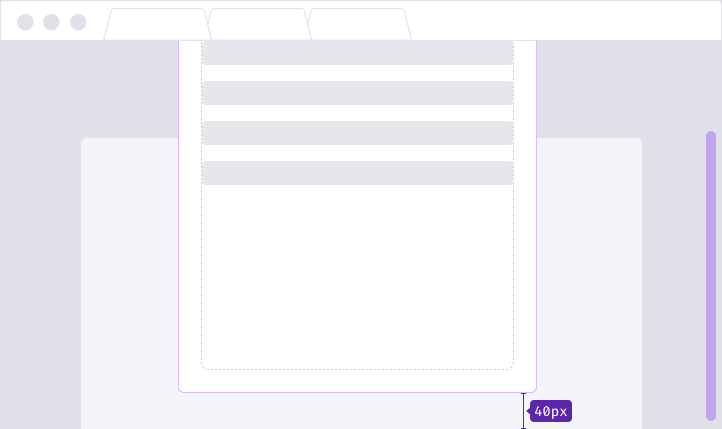

### Scrolling content in the window

Individual elements within the window, such as tables, can be scrolled. The scrolling functionality is described in [ScrollArea](/components/scroll-area/).

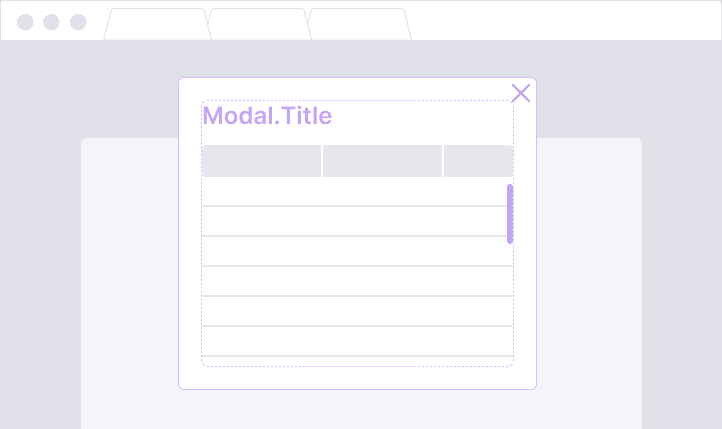

### Fixed areas during scrolling

If necessary, specific areas within the modal window can be fixed. For example, buttons within a window that contains a large amount of scrollable content.

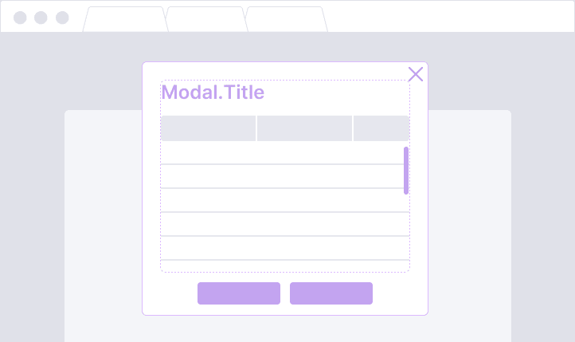

@## Window title

When the modal window is intended to prompt a specific user action, provide a concise and clear title for the window, preferably consisting of no more than 3-4 words.

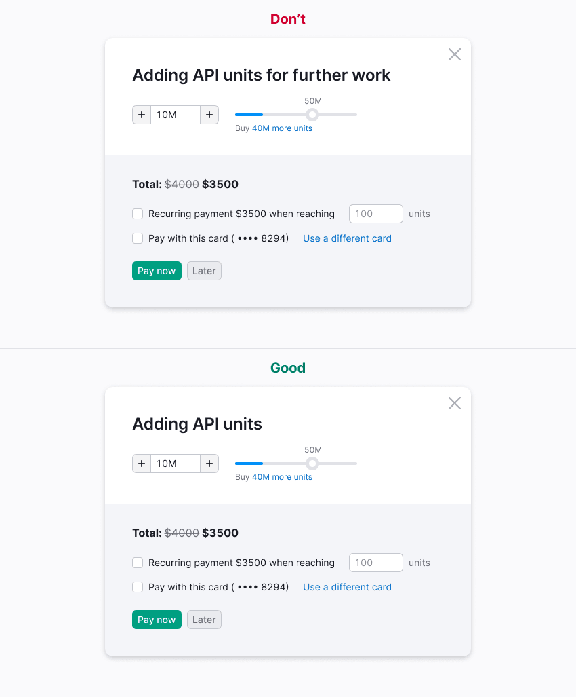

If the modal window is used for confirmation, the title should pose a question, and the action buttons should clearly answer that question.

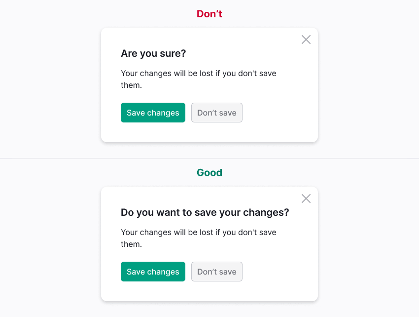

@## Button usage in modal window

The alignment of the buttons should follow the same centering as the title.

It is advisable to limit the usage of main buttons within the modal window to a maximum of two.

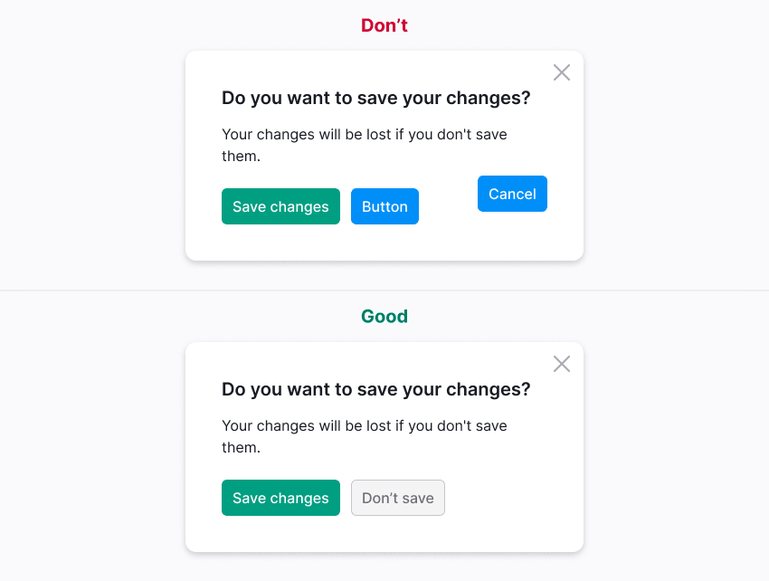

**Avoid labeling the main button as "OK".** Users may require additional time to comprehend the required action if the buttons and their functions are not clearly designated.

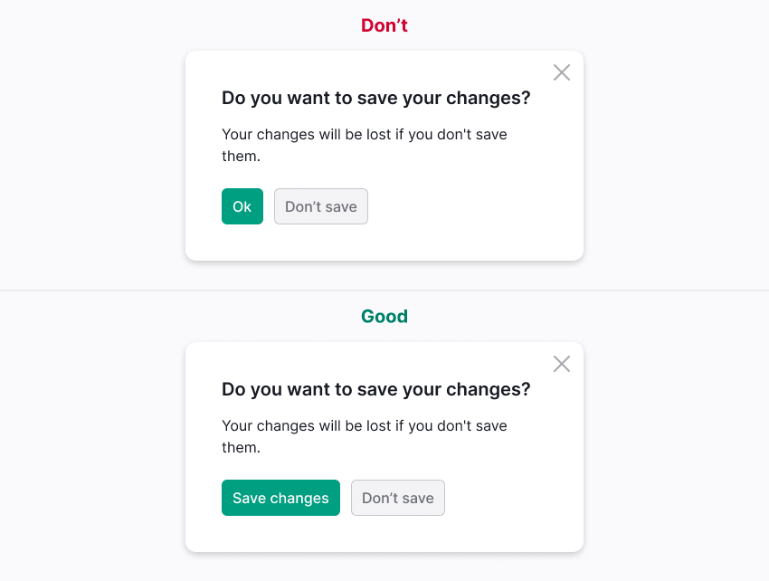

@page modal-a11y
@page modal-api
@page modal-code
@page modal-changelog
