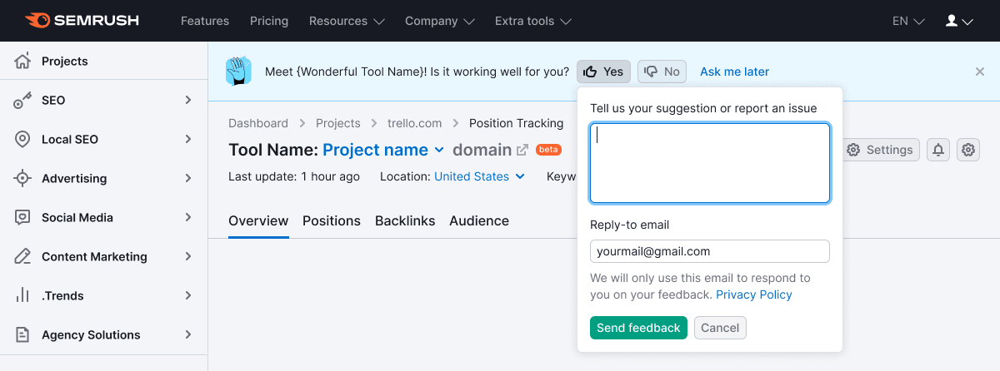
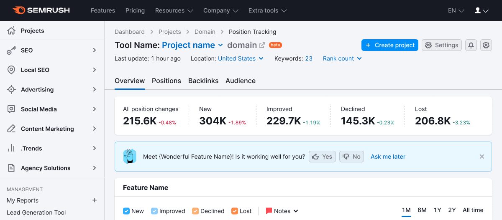
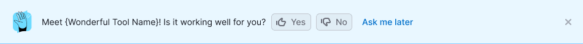
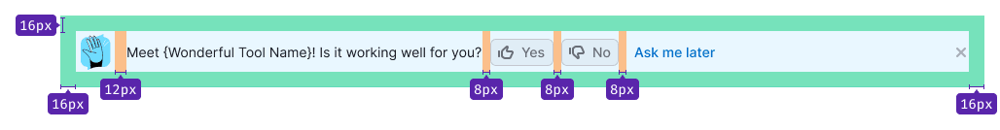

@## Description

**FeedbackYesNo** represents a feedback collection pattern. This pattern consists of the [Notice](/components/notice/) and [Feedback form](/components/feedback/). Its purpose is to introduce a new feature to the user and pose a straightforward question about the product's performance. _For instance, "Discover our new Dashboard! Is it functioning effectively for you?"_

@## Component appearance

There are two potential variants for the notice to appear:

1. The notice appears simultaneously with the loading of the product or report.
2. The notice is displayed for the first time in the second session (recommended). Subsequently, it remains visible until closed or the "Ask me later" button is clicked.

The length of a session is determined by the Product Owner or UX designer of the product. It might be defined as a time interval, the next page load, or an update of company data.

@## Location

Typically, this component is positioned at the top of a report or product.

It is also could be placed next to the feature for which feedback is desired.

@## Styles

- The notice's height is 72px.
- Preceding the text, include the [Feedback illustration](/style/illustration/). The image dimensions are 40px x 40px.
- The "Ask me later" button is designed as a button with `use="tertiary"` and `theme="info"`, not as a link.

### Margins and paddings

@## Form behavior

Refer to the comprehensive behavior description of the feedback dropdown in the [Feedback](/components/feedback/).

@## Buttons behavior

### "Yes" and "No" buttons

- The pressed button becomes `active`.
- The dropdown with the feedback form appears from the pressed button over `500ms`.
- The focus is directed to the textarea, with a placeholder stating: "Please provide suggestions or report issues."

### "Send feedback" button

- The button that triggers the dropdown for sending a message remains `active`.
- After field validation and message sending, an illustration and the text "Thank you for your feedback!" are displayed in the dropdown.
- After `2500ms`, the dropdown is gently closed with a `500ms` `fade-out` effect. An additional `500ms` later, the dropdown with buttons is also closed, smoothly lifting the entire page content over `500ms`.

### "Cancel" button

- Pressing the "Yes" or "No" button reverts it to its normal state.
- The notice remains visible.

@## Closing and appearing of the notice

### "Ask me later" button

1. This button is consistently present within the notice, following the "Yes" and "No" buttons.
2. Clicking this button closes the notice.
3. Over `500ms`, the product/report content shifts upwards.
4. The notice reappears in the user's next session.

### Close icon

The `Close` icon is optional.

Display this element if the report or product offers an alternate method for sending feedback (such as a "Send Feedback" link next to the settings).

- The first option involves having the `Close` icon always present within the notice.
- The second option (**recommended**) entails the `Close` icon appearing after clicking "Ask me later" and upon reopening the notice in the second session (which could be the second, third, or subsequent sessions).

@## Remembering states

1. If the user submits feedback, the notice will no longer appear to them.
2. Storing this status in the user's profile is advisable, in order to avoid being intrusive.
3. It is permissible to use local storage for saving the closing and appearing statuses.

@## Events arrangement

@table-caption Events arrangement

| Description                                                          | Action        | Label               | Value       |
| -------------------------------------------------------------------- | ------------- | ------------------- | ----------- |
| Clicked the button `Yes`                                             | FeedbackYesNo | Click `Yes`         |             |
| Feedback sending                                                     | FeedbackYesNo | Send `Feedback`     | `yes_click` |
| Feedback sending                                                     | FeedbackYesNo | Send `Feedback`     | `no_click`  |
| Clicked the button `No`                                              | FeedbackYesNo | Click `No`          |             |
| Clicked `Сancel` button in the dropdown                              | FeedbackYesNo | Click `Cancel`      |             |
| Block showing                                                        | FeedbackYesNo | Show                |             |
| Closing by clicking the `Close` icon                                 | FeedbackYesNo | Close               |             |
| Clicked `Ask me later`                                               | FeedbackYesNo | Click Ask           |             |
| Appearance of an error in the input for the comment text             | FeedbackYesNo | No valid Comment    |             |
| Appearance of an error in the input for the email                    | FeedbackYesNo | No valid Email      |             |
| Error of empty email                                                 | FeedbackYesNo | Empty Email         |             |
| Error of empty comment                                               | FeedbackYesNo | Empty Comment       |             |
| Appearance of the [red notice](/components/notice/) on wrong sending | FeedbackYesNo | Error Send          |             |
| Click email for communication `You can also send us an email...`     | FeedbackYesNo | Click Email Support |             |

@page feedback-yes-no-a11y
@page feedback-yes-no-code
