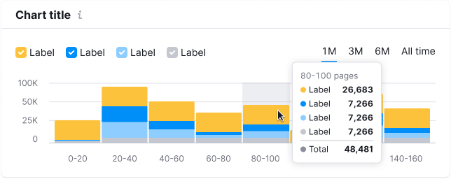
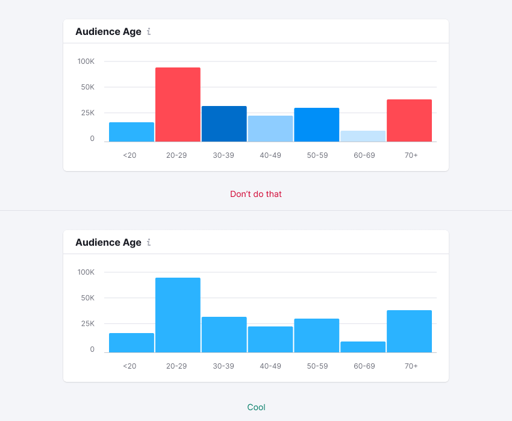

> 💡 Basic data visualization rules are described in the [Chart principles](/data-display/chart/).

@## Description

**Histogram chart** helps grouping numeric data for comparison by quantitative indicators. It shows the distribution of values.

Use histogram when you need to display the distribution of data sets by groups (e.g., quantitative ranges).

**Important points to keep in mind when presenting data as a histogram:**

- Always start the Y-axis from zero.
- The axes should be clear to the user from the chart name. However, in cases where the chart name is not enough, you can denote the axes.
- Don't use too many colors to represent categories. One color or shades of one color is enough. However, you can always highlight a category if necessary.
- You can place histogram bars horizontally if the range names are long and there are many ranges.

> 💡 Difference from bar chart
>
> - Histogram chart are used to display distribution of data sets: how often values fall into quantitative ranges.
> - Bar chart displays the distribution of data sets by quality categories for comparison.
>
> `Histograms are used to show distributions of variables while bar charts are used to compare variables`, [source](https://www.forbes.com/sites/naomirobbins/2012/01/04/a-histogram-is-not-a-bar-chart/#93b29b6d775f).
>
> _For example, we want to compare revenues of five companies. In this case, we should use [bar chart](/data-display/bar-chart/)._
>
> If we want to compare the number of companies that earn from 0 to 10,000; from 10,000 to 20,000; from 20,000 to 30,000, etc., then we should use the histogram chart.
>
> - In statistics, a histogram is a visual representation of the probability density function of a random variable based on a sample.
> - Most often, in order to ease the perception, the width of the columns shall be the same size.

@## Appearance

If you need to display different categories of data within a dataset, use Stacked histogram chart.

### Vertical histogram chart

The bars have `border-radius` of 2px. Margin between the bar is minimal.

### Horizontal histogram chart

The bars have `border-radius` of 2px. Margin between the bar is minimal.

@## Color usage

- Use [chart palette](/data-display/chart-palette/) and follow the the recommendations it has.
- **You can color the histogram bars in different colors when this can be useful for easier reading of the chart.** But use it carefully. _For example, you need to highlight a certain gradation of ranges. In this case, you can choose the appropriate colors from the chart palette._

@## Legend and axes

As a rule, a histogram does not need a legend. You only need to clearly name the chart and in some cases you can add names to the axes.

@## Sorting of columns

Don't forget to use a reasonable order of values to distribute your data sets. For example, from the largest value to the smallest one, and if they represent months - from January to December, etc.

> 💡 You can't change the order of the bars on the histogram, depending on the size of bars on the `Y-axis`. This will make it harder to read the data.

@## Outliers

In some cases some of the values in our data are very different from the majority of values.

If you show this picture as it is, with a zero value on the `Y-axis`, then large values will draw all the attention to themselves, while the rest of the data will appear to be zero.

> 💡 **The bar has a minimum height of 2px.** It is necessary so that the column does not "disappear" if there are extremely large values next to it.

Possible solutions for such cases are described in the guide about bar charts, [see the section describing outliers](/data-display/bar-chart/). **The recommended solution is to make the scale logarithmic instead of linear.**

@## Interaction

When you hover over a column, we highlight it with `--gray-200` color with .3 opacity. The hover takes up half of the margin column on the right and left sides.

If the column is clickable, the cursor changes to `pointer`.

@## Edge cases

Here you will find the states for some specific cases. All other "empty states" for widgets are specified in [Error & n/a widget states](/components/widget-empty/).

### Data for one range

- We display a single bar if we only have data for one range.
- In the missing data area, display `n/a` in the tooltip as well as the message that there are no data for this period.

### Null values

If all the values on the chart are zero, then show 0 for them in the tooltip.

> **Zero is also data. 0 ≠ `n/a`.**

### A part of the chart contains no data

- Do not display bars in the area without data.
- When you hover over a range without data, show the tooltip with the `n/a` value. We also recommend you to add a message, which explains why there is no data, and when it will be available (if possible).

### Initial loading

When loading the chart for the first time, show [Skeleton](/components/skeleton/) instead of the chart.

If the chart has a title, show it during the loading. The user shall have an idea of what is being loaded and whether they need to wait for the loading process to complete.

More information about this state see in the guide for [Skeleton](/components/skeleton/).

@## Use in UX/UI

- Start the columns from zero.
- By comparing columns, we are actually comparing the length. If we do not start the scale from zero, there will be a visual illusion.

Check out the charts below. In the wrong case, the scale does not start from zero, and it seems that the `Y value` is almost half as large as the `X value`. However, this is not true.

@page histogram-chart-api
@page histogram-chart-code
