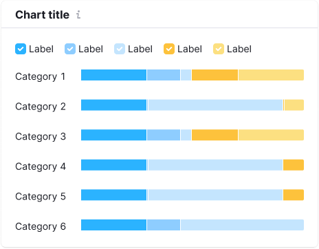

> 💡 Basic data visualization rules are described in the [Chart principles](/data-display/chart/).

@## Description

**Bar chart** visualizes distribution of values by category for value comparison. A bar chart can be [vertical](/data-display/bar-chart/) or horizontal.

> 💡 **Difference from histogram chart**
>
> Bar chart displays distribution of data sets by quality categories.
>
> Histogram charts are used to display distribution of data sets: how often values fall into quantitative ranges.

Important points to keep in mind when presenting data as a bar chart:

- The axes should be clear to the user from the chart name. However, in cases where the chart name is not enough, you can denote the axes.
- Don't use too many colors to represent categories. One color or shades of one color is enough. However, you can always highlight a category if necessary.

@## Usage

See detailed information in the [Horizontal bar chart guide](/data-display/bar-horizontal/#ac6451).

@## Margins

See detailed information in the [Horizontal bar chart guide](/data-display/bar-horizontal/#abd326).

@## Grid and axes

See detailed information in the [Horizontal bar chart guide](/data-display/bar-horizontal/#a9e6f0).

@## Labels of categories

See detailed information in the [Horizontal bar chart guide](/data-display/bar-horizontal/#a05155).

@## Appearance

The stacked bar chart has no margin between categories inside the bar. **Choose contrasting colors for different categories.**

@## Interaction

When you hover over a column, we highlight it with `--gray-200` color with .3 opacity. The hover takes up half of the margin column on the right and left sides.

If the column is clickable, the cursor changes to `pointer`.

@## Edge cases

Edge cases for stacked bar chart are pretty much the same as [Horizontal bar chart](/data-display/bar-horizontal/#a54381) has.

@## Data loading

See detailed information in the section about data loading in the [Horizontal bar chart guide](/data-display/bar-horizontal/#ac26f2).

@page stacked-horizontal-bar-api
@page stacked-horizontal-bar-d3-code
@page stacked-horizontal-bar-recharts-code
